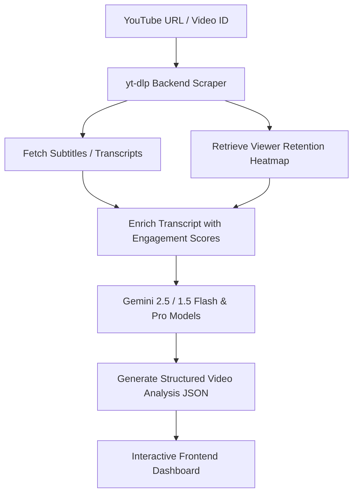

# 🎬 CHEAT CLIP

> **AI-powered YouTube Viral Hotspot Finder** — Instantly discover the most re-watched, highest-engagement moments in any YouTube video.

---

## 🚀 How it Works



---

## ✨ Features

- 📊 **Audience Retention Heatmaps** — Maps the exact moments viewers rewound and re-watched most using `yt-dlp` player interaction data, plotted on an interactive canvas.
- 🧠 **Google Gemini 2.5 Flash / Pro Integration** — Employs the modern `google-genai` Python SDK to scan enriched transcripts, identifying hooks, punchlines, and high-energy story arcs. Includes automatic fallback and retry logic.
- 🕒 **Custom Search Range** — Crop video analysis bounds (e.g., `29:00–31:15`) to target clips from specific segments.
- 🎯 **AI Custom Focus Prompt** — Direct Gemini to focus clip identification on specific topics, themes, or keyword triggers.
- 🔢 **Custom Clip Counts** — Set an explicit target clip count (1-50) or let the backend scale automatically (10-30 for short videos, 15-60 for long videos).
- 📝 **Manual Subtitles Upload** — Parse custom SRT, TXT, or raw paragraph texts when YouTube subtitles are unavailable (e.g., live streams, restricted videos).
- 🕓 **Persistent Analysis History** — Local storage caching preserves previous video thumbnails, metadata, and analysis results for instant reload without key usage.
- 🔍 **Advanced Filtering & Sorting** — Filter by virality score (`High 90%+`, `Mid`, `Low`) or checklist status. Sort clips by virality, chronological order, or duration.
- 🕒 **Interactive YouTube IFrame Player** — Integrates with the YouTube IFrame Player API to track real-time playback, auto-seek to selected segments, and auto-loop or stop when a clip ends.
- 📝 **Clip Checklist & Exports** — Keep track of created clips with a checklist, copy individual clips, copy full markdown descriptions, or download the full dataset as JSON or SRT files.
- 🧪 **Mock Mode** — Test the full UI without spending API quota by using `"mock"` as your API key.

---

## 🖥️ Tech Stack

| Layer | Technology | File References |
|---|---|---|
| **Frontend** | React 19 · TypeScript · Vite | [src/App.tsx](file:///e:/PROJECT/CLIPPER/CHEAT%20CLIP/src/App.tsx) · [src/main.tsx](file:///e:/PROJECT/CLIPPER/CHEAT%20CLIP/src/main.tsx) |
| **Backend** | Python · FastAPI · Uvicorn | [backend/main.py](file:///e:/PROJECT/CLIPPER/CHEAT%20CLIP/backend/main.py) |
| **AI** | Google Gemini 2.5 / 1.5 Models | Powered by `google-genai` inside [backend/main.py](file:///e:/PROJECT/CLIPPER/CHEAT%20CLIP/backend/main.py) |
| **Video Data** | `yt-dlp` · `youtube-transcript-api` | Handled on backend setup [backend/requirements.txt](file:///e:/PROJECT/CLIPPER/CHEAT%20CLIP/backend/requirements.txt) |
| **Dev Tooling** | `concurrently` · ESLint · TypeScript | Configured in [package.json](file:///e:/PROJECT/CLIPPER/CHEAT%20CLIP/package.json) |

---

## 🚀 Setup & Getting Started

### Prerequisites

Make sure you have the following installed:

| Tool | Version | Link |
|---|---|---|
| **Node.js** | v18+ | [nodejs.org](https://nodejs.org/) |
| **Python** | 3.10+ | [python.org](https://www.python.org/) |
| **pip** | (bundled with Python) | — |

You will also need a **Google Gemini API Key** (free):
👉 [https://aistudio.google.com/](https://aistudio.google.com/)

---

### Step 1 — Clone the Repository

```bash
git clone https://github.com/your-username/cheat-clip.git
cd cheat-clip
```

---

### Step 2 — Configure Environment Variables

The backend reads your Gemini API key from `backend/.env`.

```bash
# Windows (PowerShell)
Copy-Item backend/.env.template backend/.env

# macOS / Linux
cp backend/.env.template backend/.env
```

Then open `backend/.env` and add your key:

```env
GEMINI_API_KEY=your_gemini_api_key_here
```

> [!TIP]
> You can also skip this step and enter your key directly in the app UI at runtime — it will be cached securely in your browser's local storage.

---

### Step 3 — Install Frontend Dependencies

```bash
npm install
```

---

### Step 4 — Install Backend Dependencies

Make sure Python is installed and run:

```bash
pip install -r backend/requirements.txt
```

> [!NOTE]
> **Windows users:** If `pip` is not recognized, run `python -m pip install -r backend/requirements.txt`.

---

### Step 5 — Run the Development Servers

```bash
npm run dev
```

This starts **both** servers concurrently:

| Service | URL | Command |
|---|---|---|
| **Frontend (Vite + React)** | [http://localhost:5173](http://localhost:5173) | `npm run dev-frontend` |
| **Backend (FastAPI)** | [http://localhost:8000](http://localhost:8000) | `npm run dev-backend` |

---

## 📜 Available Scripts

See scripts inside [package.json](file:///e:/PROJECT/CLIPPER/CHEAT%20CLIP/package.json):

| Command | Description |
|---|---|
| `npm run dev` | Starts both frontend (Vite) and backend (FastAPI) concurrently |
| `npm run dev-frontend` | Starts only the Vite dev server |
| `npm run dev-backend` | Starts only the Python FastAPI server |
| `npm run build` | Compiles TypeScript and bundles the production frontend |
| `npm run preview` | Preview the production build locally |
| `npm run lint` | Run ESLint code quality checks |

---

## 🔑 API Key Configuration

> [!IMPORTANT]
> A Gemini API key is required for real AI-powered analysis. Without one, use **Mock Mode** for UI testing.

You can provide your key in two ways:
1. **Server-side** (recommended) — Set `GEMINI_API_KEY` in `backend/.env` (see template: [backend/.env.template](file:///e:/PROJECT/CLIPPER/CHEAT%20CLIP/backend/.env.template))
2. **In-app** — Enter your key in the app's setup UI; it's saved to browser local storage.

---

## 🧪 Mock Mode

To test the UI without using API quota:
1. Leave the Gemini API key field **empty** or enter `mock`
2. Submit any YouTube URL
3. The app returns a realistic pre-built response instantly — no API calls made.

---

## 📡 API Reference

The backend runs at `http://localhost:8000` via [backend/main.py](file:///e:/PROJECT/CLIPPER/CHEAT%20CLIP/backend/main.py).

### `GET /api/health`

Returns server status.

```json
{ "status": "ok", "message": "CHEAT CLIP API is active" }
```

---

### `GET /api/models`

Fetches list of available text-generation Gemini models filtered by user capabilities.

**Query Parameter:**
- `api_key` (string, required): Gemini API key to check.

**Response:**
```json
{
  "models": ["gemini-2.5-flash", "gemini-2.5-flash-lite", "gemini-2.0-flash", "gemini-2.0-flash-lite", "gemini-2.5-pro"]
}
```

---

### `POST /api/analyze`

Analyzes a YouTube video and streams real-time progress via **Server-Sent Events (SSE)**, followed by the final clip results.

**Request body:**

```json
{
  "url": "https://www.youtube.com/watch?v=VIDEO_ID",
  "duration": "30s",
  "api_key": "your_gemini_api_key",
  "model": "gemini-2.5-flash",
  "custom_prompt": "Find key highlights about artificial intelligence",
  "range_start": 60.0,
  "range_end": 300.0,
  "subtitles": "1\n00:01:00,000 --> 00:01:05,000\nAI is here...",
  "target_clip_count": 10
}
```

| Field | Type | Required | Description |
|---|---|---|---|
| `url` | `string` | ✅ | YouTube video URL or 11-char ID |
| `duration` | `string` | ✅ | Target clip length: `"15s"`, `"30s"`, `"60s"` |
| `api_key` | `string` | ❌ | Overrides server key. Use `"mock"` for Mock Mode |
| `model` | `string` | ❌ | Model name (default: `"gemini-2.5-flash"`) |
| `custom_prompt` | `string` | ❌ | Custom topic focus instruction |
| `range_start` | `number` | ❌ | Start analysis bound in seconds |
| `range_end` | `number` | ❌ | End analysis bound in seconds |
| `subtitles` | `string` | ❌ | Manual subtitles upload block (SRT/TXT formats) |
| `target_clip_count` | `number` | ❌ | Explicit target number of clips (1-50) |

---

## 📁 Project Structure

```
cheat-clip/
├── backend/
│   ├── main.py              # FastAPI app — SSE endpoints & model listing
│   ├── requirements.txt     # Python dependencies list
│   ├── .env.template        # Environment variable template
│   └── .env                 # API key file (git-ignored)
├── src/
│   ├── App.tsx              # Main React Dashboard, YT IFrame tracker, checklist, filters
│   ├── components/
│   │   └── HeatmapTimeline.tsx  # Interactive retention heatmap rendering
│   ├── types.ts             # TypeScript type definitions
│   ├── index.css            # Global CSS dark theme & design tokens
│   └── main.tsx             # React entry point
├── public/                  # Static assets
├── index.html               # HTML root
├── vite.config.ts           # Vite configuration
├── tsconfig.json            # TypeScript configuration
├── package.json             # Node dependencies & concurrently scripts
└── vercel.json              # Vercel deployment configuration
```

---

## 🌐 Deployment

This project is configured for **Vercel** deployment via [vercel.json](file:///e:/PROJECT/CLIPPER/CHEAT%20CLIP/vercel.json).

For the backend, deploy the FastAPI app separately (e.g. Railway, Render, or a VPS), then update the frontend's API base URL accordingly.

---

## 🐛 Troubleshooting

| Issue | Solution |
|---|---|
| `python` not found | Use `python3` or ensure Python is added to your system `PATH` |
| `uvicorn` not found | Run `pip install uvicorn` or check virtual environment status |
| Port 8000 already in use | Change port: `npm run dev-backend -- --port 8001` |
| `yt-dlp` errors | Update yt-dlp: `pip install -U yt-dlp` |
| CORS errors in browser | Ensure the backend is running at `http://localhost:8000` |
| Transcript not found | Check if video has captions enabled, or upload subtitles manually |

---

## 📄 License

MIT — see [LICENSE](LICENSE) for details.

---

<p align="center">
  Built with ❤️ using React, FastAPI, and Google Gemini
</p>
